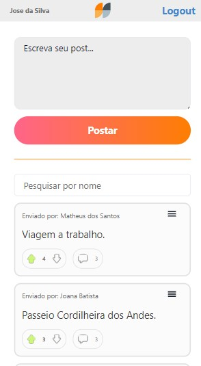
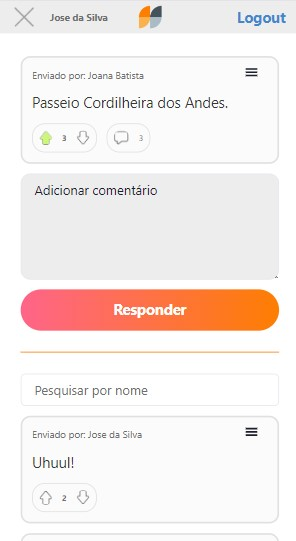

# Projeto Labeddit Front-end

### Link da aplicação (deploy):
[Labeddit](https://labeddit-conway-y.surge.sh/)

### Link do repositório Back-end deste projeto:
[Labeddit Back-end](https://github.com/Yuriba012/Labeddit-backend)

### Acesse a documentação da API através do link: 
[Labeddit API Documentation](https://documenter.getpostman.com/view/25826645/2s93m611yx)

<div style="display: flex;justify-content:center;">

</div>
<div style="text-align:justify; margin: 20px 0">
Este repositório contém o código referente ao Front-end de um projeto Full Stack chamado Labeddit. A interface foi desenvolvida principalmente para mobile, podendo ser utilizada adequadamente também em desktop.
O projeto consiste em uma rede social com alguns detalhes que lembram a Reddit. Nessa aplicação, você pode criar o seu usuário ou efetuar o login caso já possua uma conta. Entrando na página principal, terá um feed com as publicações de todos os usuários da rede ordenadas pelo maior número de likes. Você pode criar sua publicação e interagir com as publicações de outros usuários efetuando likes ou dislikes. Você também pode comentar as publicações de outros usuários e interagir com outros comentários.
</div>

## Ìndice

- <a href="#funcionalidades">Funcionalidades do Projeto</a>
- <a href="#demonstracao">Demonstração</a>
- <a href="#rodar">Como rodar este projeto?</a>
- <a href="#tecnologias">Tecnologias Utilizadas</a>
- <a href="#autor">Autor</a>

## Funcionalidades do projeto

- [x] Login
- [x] SignUp
- [x] Interação com publicações por meio likes/dislikes
- [x] Interação com publicações por meio comentários
- [x] Criar publicação
- [x] Criar comentário
- [x] Visualizar todas as publicações dos usuários
- [x] Visualizar todos os comentários de uma publicação

## Layout





## Demonstração

[Demonstracao / Deploy](https://labeddit-client-side-media.surge.sh/)

## Como rodar este projeto?

```bash
# Clone este repositório
$ git clone https://github.com/Yuriba012/Labeddit-client

# Acesse a pasta do projeto no seu terminal
$ cd Labeddit-client

# Instale as dependências do React e bibliotecas
$ npm install

# Execute a aplicação
$ npm run start

# A aplicação será iniciada na porta 3000, acesse no seu navegador pelo endereço: http://localhost:3000
```

## Tecnologias utilizadas

1. [React JS](https://pt-br.reactjs.org/)
2. [React Router](https://reactrouter.com/en/main)
3. [Axios](https://axios-http.com/ptbr/docs/intro)
4. [Styled-Components](https://styled-components.com/)
5. [Chakra UI](https://styled-components.com/)

## Autor

<div style="display: flex;justify-content:center;">

</div>

## Yuri Barañano S. Moralles
[Linkedin](https://www.linkedin.com/in/yuri-moralles-ab752291/)